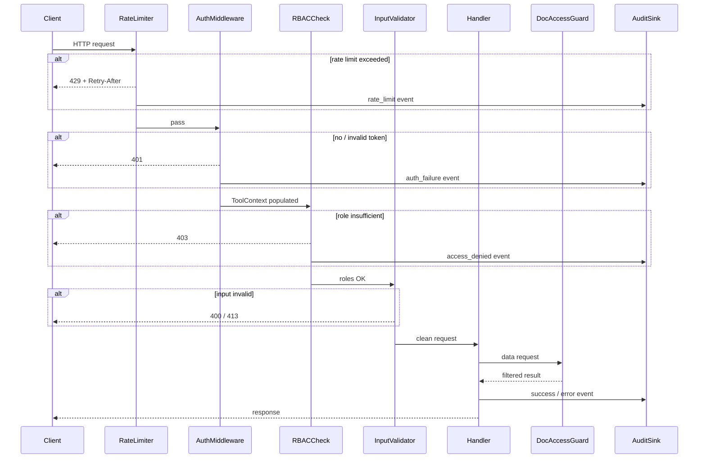
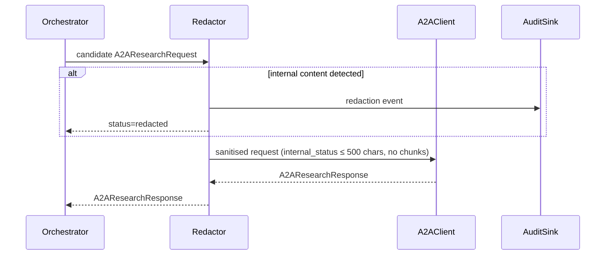
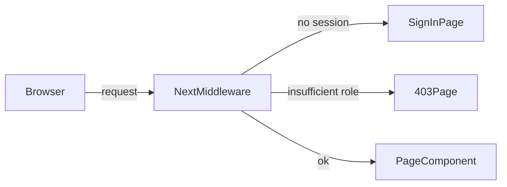

# Design Document — Enterprise Security Hardening

## Overview

Phase 10 adds ten interlocking security layers to the Omni-Modal Enterprise Research
Orchestrator. The system already has a typed `ToolContext`, a `ToolPermissionGuard`, a
`SecretRef`-based secret boundary, and observability breadcrumbs. This phase builds on those
foundations rather than replacing them.

The changes span two runtimes:

- **Python backend** (`services/api/src/omni_modal/`) — auth middleware, RBAC on HTTP endpoints,
  document-level access guard, input validation, upload safety, content redactor, enhanced audit
  sink, and rate limiter.
- **Next.js 16 frontend** (`apps/web/`) — route protection middleware and client-side upload
  validation.

Every new component is a pure addition; no existing contracts (`ToolContext`, `AuditSink`,
`ToolPermissionGuard`, `SecretRef`) are broken. New components are injected through the existing
constructor-injection pattern already used by `McpToolRouter`.

### Design Principles

1. **Fail closed** — any ambiguity in a security check resolves to denial, not permission.
2. **Defence in depth** — each layer is independent; a bypass in one layer does not grant access.
3. **Audit everything** — every security-relevant outcome writes an audit record before the
   response is sent.
4. **Secrets never travel** — raw credential values are never serialised into responses, logs,
   or delegation payloads; `SecretRef.__str__` already enforces this for the secret layer.
5. **Tenant isolation** — no query, rate-limit bucket, or audit stream crosses tenant boundaries.

---

## Architecture

The request pipeline adds security components as ordered middleware in front of the existing
handler. The diagram below shows the **backend request lifecycle** after Phase 10:



The **A2A delegation path** gains a Redactor step between the orchestrator and the
`HttpA2AResearchClient`:



The **frontend middleware** intercepts navigation at the edge before any page component renders:



---

## Components and Interfaces

### 2.1 Auth Middleware (`security/auth.py`)

Validates HMAC-SHA256 signed JWT bearer tokens on every incoming request except `GET /health`.

```python
# security/auth.py

from __future__ import annotations
import base64, hashlib, hmac, json, os, time
from dataclasses import dataclass
from typing import Protocol


@dataclass(frozen=True)
class JwtClaims:
    tenant_id: str
    user_id: str
    roles: tuple[str, ...]
    exp: int  # Unix timestamp


class AuthError(Exception):
    """Raised when a bearer token is absent, malformed, or invalid."""


def _b64url_decode(segment: str) -> bytes:
    padding = 4 - len(segment) % 4
    return base64.urlsafe_b64decode(segment + "=" * (padding % 4))


def verify_jwt(token: str, secret: str) -> JwtClaims:
    """Verify a compact HS256 JWT and return its claims.

    Raises AuthError for any structural or cryptographic failure.
    """
    parts = token.split(".")
    if len(parts) != 3:
        raise AuthError("Malformed JWT: expected three dot-separated segments.")

    header_b64, payload_b64, sig_b64 = parts

    # Verify header
    try:
        header = json.loads(_b64url_decode(header_b64))
    except Exception as exc:
        raise AuthError(f"Malformed JWT header: {exc}") from exc
    if header.get("alg") != "HS256" or header.get("typ") != "JWT":
        raise AuthError("JWT must use alg=HS256 and typ=JWT.")

    # Verify signature (constant-time)
    signing_input = f"{header_b64}.{payload_b64}".encode()
    expected_sig = hmac.new(secret.encode(), signing_input, hashlib.sha256).digest()
    try:
        actual_sig = _b64url_decode(sig_b64)
    except Exception as exc:
        raise AuthError(f"Malformed JWT signature: {exc}") from exc
    if not hmac.compare_digest(expected_sig, actual_sig):
        raise AuthError("JWT signature verification failed.")

    # Decode payload
    try:
        payload = json.loads(_b64url_decode(payload_b64))
    except Exception as exc:
        raise AuthError(f"Malformed JWT payload: {exc}") from exc

    # Validate required claims
    exp = payload.get("exp")
    if not isinstance(exp, int) or exp <= int(time.time()):
        raise AuthError("JWT is expired or missing exp claim.")

    tenant_id = payload.get("tenant_id") or payload.get("tid")
    if not isinstance(tenant_id, str) or not tenant_id:
        raise AuthError("JWT is missing tenant_id claim.")

    user_id = payload.get("user_id") or payload.get("sub")
    if not isinstance(user_id, str) or not user_id:
        raise AuthError("JWT is missing user_id claim.")

    raw_roles = payload.get("roles", [])
    roles: tuple[str, ...] = tuple(r for r in raw_roles if isinstance(r, str))

    return JwtClaims(
        tenant_id=tenant_id, user_id=user_id, roles=roles, exp=exp
    )


def jwt_secret_from_env() -> str:
    secret = os.environ.get("JWT_SECRET")
    if not secret:
        raise RuntimeError("JWT_SECRET environment variable is not set.")
    return secret
```

**Integration in `OmniModalHandler`**: `do_GET` and `do_POST` call a shared
`_authenticate(path)` helper that returns a `JwtClaims` or writes a 401 response and returns
`None`. The handler skips authentication only when `self.path == "/health"`.

---

### 2.2 RBAC Endpoint Guard (`security/rbac.py`)

Maps HTTP paths to required role sets.

```python
# security/rbac.py

from __future__ import annotations
from typing import FrozenSet

ENDPOINT_ROLES: dict[str, FrozenSet[str]] = {
    "/query":          frozenset({"researcher", "admin"}),
    "/query/stream":   frozenset({"researcher", "admin"}),
    "/ingest/local":   frozenset({"researcher", "admin"}),
}


class RbacError(Exception):
    pass


def assert_endpoint_roles(path: str, roles: tuple[str, ...]) -> None:
    """Raise RbacError if the caller's roles don't satisfy the endpoint's requirements."""
    required = ENDPOINT_ROLES.get(path)
    if required is None:
        return  # unknown path — 404 will be returned by the normal handler
    if not frozenset(roles) & required:
        raise RbacError(
            f"Endpoint {path} requires one of: {', '.join(sorted(required))}."
        )
```

---

### 2.3 Document Access Guard (`security/document_access.py`)

Filters document results to enforce `AccessMetadata` visibility rules. Operates as a
**decorator** around `McpDataAccess`, making enforcement transparent to the tool layer.

```python
# security/document_access.py

from __future__ import annotations
from dataclasses import dataclass, field
from typing import Literal

from omni_modal.mcp.data_access import AuditSink, McpDataAccess
from omni_modal.mcp.models import (
    AuditLogSummary, ChunkSummary, DocumentDetail,
    DocumentSummary, EntitySummary, ToolContext,
)


Visibility = Literal["private", "tenant", "restricted"]


@dataclass
class AccessMetadata:
    visibility: Visibility = "tenant"
    owner_id: str | None = None
    allowed_user_ids: list[str] = field(default_factory=list)
    allowed_roles: list[str] = field(default_factory=list)


class AccessDenied(Exception):
    pass


def check_access(
    context: ToolContext,
    doc_tenant_id: str,
    meta: AccessMetadata,
) -> bool:
    """Return True iff the caller may read this document."""
    if context.tenant_id != doc_tenant_id:
        return False
    if meta.visibility == "private":
        return context.actor_user_id == meta.owner_id
    if meta.visibility == "tenant":
        return True
    if meta.visibility == "restricted":
        user_ok = context.actor_user_id in meta.allowed_user_ids
        role_ok = bool(frozenset(context.roles) & frozenset(meta.allowed_roles))
        return user_ok or role_ok
    return False


class DocumentAccessGuard:
    """Wraps McpDataAccess and filters results by AccessMetadata."""

    def __init__(
        self, inner: McpDataAccess, audit_sink: AuditSink
    ) -> None:
        self._inner = inner
        self._audit = audit_sink

    def search_documents(
        self, context: ToolContext, query: str, limit: int, status: str | None = None
    ) -> list[DocumentSummary]:
        results = self._inner.search_documents(context, query, limit, status)
        return [d for d in results if self._allowed_summary(context, d)]

    def get_document(
        self, context: ToolContext, document_id: str
    ) -> DocumentDetail | None:
        doc = self._inner.get_document(context, document_id)
        if doc is None:
            return None
        if not self._allowed_detail(context, doc):
            return None  # return empty rather than 404 to avoid oracle attacks
        return doc

    def search_chunks(
        self, context: ToolContext, query: str, limit: int,
        document_id: str | None = None,
    ) -> list[ChunkSummary]:
        chunks = self._inner.search_chunks(context, query, limit, document_id)
        return [c for c in chunks if self._chunk_allowed(context, c)]

    def get_entities(
        self, context: ToolContext, document_id: str,
        labels: list[str] | None = None, limit: int = 50,
    ) -> list[EntitySummary]:
        entities = self._inner.get_entities(context, document_id, labels, limit)
        return [e for e in entities if self._entity_allowed(context, e)]

    def get_audit_logs(
        self, context: ToolContext, resource_type: str | None = None,
        resource_id: str | None = None, limit: int = 50,
    ) -> list[AuditLogSummary]:
        # Audit logs are tenant-scoped by the data layer; no additional filter needed.
        return self._inner.get_audit_logs(context, resource_type, resource_id, limit)

    # --- private helpers ---

    def _allowed_summary(self, context: ToolContext, doc: DocumentSummary) -> bool:
        meta = AccessMetadata(visibility="tenant", owner_id=doc.owner_id)
        return check_access(context, context.tenant_id, meta)

    def _allowed_detail(self, context: ToolContext, doc: DocumentDetail) -> bool:
        visibility: Visibility = doc.metadata.get("visibility", "tenant")  # type: ignore[assignment]
        meta = AccessMetadata(
            visibility=visibility,
            owner_id=doc.owner_id,
            allowed_user_ids=doc.metadata.get("allowed_user_ids", []),
            allowed_roles=doc.metadata.get("allowed_roles", []),
        )
        return check_access(context, context.tenant_id, meta)

    def _chunk_allowed(self, context: ToolContext, chunk: ChunkSummary) -> bool:
        visibility: Visibility = chunk.metadata.get("visibility", "tenant")  # type: ignore[assignment]
        meta = AccessMetadata(
            visibility=visibility,
            owner_id=chunk.metadata.get("owner_id"),
            allowed_user_ids=chunk.metadata.get("allowed_user_ids", []),
            allowed_roles=chunk.metadata.get("allowed_roles", []),
        )
        return check_access(context, context.tenant_id, meta)

    def _entity_allowed(self, context: ToolContext, entity: EntitySummary) -> bool:
        # Entity access is gated at the document level; no separate entity metadata.
        return True
```

---

### 2.4 Input Validator (`security/input_validation.py`)

Centralises all structural and length checks so handlers stay clean.

```python
# security/input_validation.py

from __future__ import annotations
import re
from uuid import UUID

UUID_V4_RE = re.compile(
    r"^[0-9a-f]{8}-[0-9a-f]{4}-4[0-9a-f]{3}-[89ab][0-9a-f]{3}-[0-9a-f]{12}$",
    re.IGNORECASE,
)

MAX_BODY_BYTES     = 1_048_576   # 1 MiB
MAX_QUERY_CHARS    = 4_096
MAX_TENANT_ID_CHARS = 128


class ValidationError(ValueError):
    """Raised when an HTTP request fails structural validation."""


def assert_body_size(content_length: int) -> None:
    if content_length > MAX_BODY_BYTES:
        raise ValidationError(
            f"Request body exceeds maximum allowed size of {MAX_BODY_BYTES} bytes."
        )


def assert_query_length(query: str) -> None:
    if len(query) > MAX_QUERY_CHARS:
        raise ValidationError(
            f"query field must not exceed {MAX_QUERY_CHARS} characters."
        )


def assert_tenant_id(tenant_id: object) -> str:
    if not isinstance(tenant_id, str) or not tenant_id or len(tenant_id) > MAX_TENANT_ID_CHARS:
        raise ValidationError(
            "tenant_id must be a non-empty string of at most "
            f"{MAX_TENANT_ID_CHARS} characters."
        )
    return tenant_id


def assert_document_id_uuid(document_id: object) -> str:
    if not isinstance(document_id, str):
        raise ValidationError("document_id must be a string.")
    if not UUID_V4_RE.match(document_id):
        raise ValidationError("document_id must be a valid UUID v4.")
    return document_id
```

---

### 2.5 Upload Safety Guard (`security/upload_safety.py`)

Runs before `MultimodalIngestionPipeline.ingest()`.

```python
# security/upload_safety.py

from __future__ import annotations
from pathlib import Path

MAX_FILE_BYTES = 52_428_800  # 50 MiB

ALLOWED_MIME_TYPES = frozenset({
    "application/pdf",
    "audio/mpeg",
    "audio/wav",
    "audio/x-wav",
    "audio/mp4",
    "audio/flac",
    "audio/x-flac",
    "audio/ogg",
    "audio/webm",
})

EXTENSION_TO_MIME: dict[str, str] = {
    ".pdf":  "application/pdf",
    ".mp3":  "audio/mpeg",
    ".wav":  "audio/wav",
    ".m4a":  "audio/mp4",
    ".flac": "audio/flac",
    ".ogg":  "audio/ogg",
    ".webm": "audio/webm",
}


class UploadSafetyError(Exception):
    """Raised when a file fails pre-ingestion safety checks."""
    def __init__(self, message: str, file_size: int, detected_mime: str | None) -> None:
        super().__init__(message)
        self.file_size = file_size
        self.detected_mime = detected_mime


def sniff_mime_type(file_path: Path) -> str | None:
    """Return the content-sniffed MIME type using python-magic or filetype fallback."""
    try:
        import magic  # python-magic
        return magic.from_file(str(file_path), mime=True)
    except ImportError:
        pass
    try:
        import filetype  # type: ignore[import]
        kind = filetype.guess(str(file_path))
        return kind.mime if kind else None
    except ImportError:
        return None


def assert_upload_safe(file_path: Path) -> tuple[int, str | None]:
    """Check size and MIME type. Returns (file_size_bytes, detected_mime).

    Raises UploadSafetyError on violation.
    """
    file_size = file_path.stat().st_size if file_path.exists() else 0

    if file_size > MAX_FILE_BYTES:
        raise UploadSafetyError(
            f"File size {file_size} exceeds maximum {MAX_FILE_BYTES} bytes.",
            file_size=file_size,
            detected_mime=None,
        )

    detected_mime = sniff_mime_type(file_path)
    extension_expected = EXTENSION_TO_MIME.get(file_path.suffix.lower())

    if detected_mime and detected_mime not in ALLOWED_MIME_TYPES:
        raise UploadSafetyError(
            f"Detected MIME type '{detected_mime}' is not permitted.",
            file_size=file_size,
            detected_mime=detected_mime,
        )

    if detected_mime and extension_expected and detected_mime != extension_expected:
        raise UploadSafetyError(
            f"MIME type mismatch: extension suggests '{extension_expected}' "
            f"but content is '{detected_mime}'.",
            file_size=file_size,
            detected_mime=detected_mime,
        )

    return file_size, detected_mime
```

---

### 2.6 Content Redactor (`security/redactor.py`)

Sanitises `A2AResearchRequest` fields before delegation.

```python
# security/redactor.py

from __future__ import annotations
import hashlib
import re
from dataclasses import replace

from omni_modal.orchestration.a2a import A2AResearchRequest, A2AResearchResponse

MAX_INTERNAL_STATUS_CHARS = 500


def _fingerprint(text: str) -> str:
    return hashlib.sha256(text.encode()).hexdigest()[:16]


def _redact_chunk_content(
    text: str, chunk_fingerprints: frozenset[str]
) -> str:
    for fp in chunk_fingerprints:
        if fp in text:
            text = text.replace(fp, "[REDACTED]")
    return text


class ContentLeakError(Exception):
    """Raised when a delegation payload contains internal content that cannot be redacted."""


def redact_request(
    request: A2AResearchRequest,
    chunk_texts: list[str],
) -> A2AResearchRequest:
    """Return a sanitised copy of request with internal content removed.

    - Truncates internal_status to MAX_INTERNAL_STATUS_CHARS.
    - Replaces chunk fingerprints in internal_status with [REDACTED].
    - Ensures question contains only the user's original question.

    Raises ContentLeakError if chunk text is detected in the question field.
    """
    fps = frozenset(_fingerprint(c) for c in chunk_texts if c)

    # Guard: question must not contain chunk content
    for chunk_text in chunk_texts:
        if chunk_text and chunk_text[:50] in request.question:
            raise ContentLeakError(
                "Delegation question contains internal document content."
            )

    # Sanitise internal_status
    status = request.internal_status[:MAX_INTERNAL_STATUS_CHARS]
    status = _redact_chunk_content(status, fps)

    return replace(request, internal_status=status)
```

---

### 2.7 Enhanced Audit Sink (`security/audit.py`)

Provides an `InMemoryAuditSink` for testing and a persistent `AuditSink` interface extension
with monotonic IDs.

```python
# security/audit.py

from __future__ import annotations
import itertools
import time
from dataclasses import dataclass, field
from typing import Protocol

from omni_modal.mcp.models import ToolContext


@dataclass
class AuditEntry:
    id: int
    tenant_id: str
    actor_user_id: str | None
    action: str
    resource_type: str
    resource_id: str | None
    status: str
    metadata: dict[str, object]
    timestamp: float  # monotonic time (seconds)


class EnhancedAuditSink(Protocol):
    def record_tool_call(
        self,
        context: ToolContext,
        tool_name: str,
        arguments: dict[str, object],
        status: str,
    ) -> str:
        ...

    def record_event(
        self,
        context: ToolContext | None,
        action: str,
        resource_type: str,
        resource_id: str | None,
        status: str,
        metadata: dict[str, object],
    ) -> str:
        ...


class InMemoryAuditSink:
    """Thread-unsafe in-memory audit sink for testing."""

    def __init__(self) -> None:
        self._counter = itertools.count(1)
        self._entries: list[AuditEntry] = []

    def record_tool_call(
        self,
        context: ToolContext,
        tool_name: str,
        arguments: dict[str, object],
        status: str,
    ) -> str:
        entry = AuditEntry(
            id=next(self._counter),
            tenant_id=context.tenant_id,
            actor_user_id=context.actor_user_id,
            action=f"tool:{tool_name}",
            resource_type="tool",
            resource_id=tool_name,
            status=status,
            metadata={"arguments": _scrub(arguments)},
            timestamp=time.monotonic(),
        )
        self._entries.append(entry)
        return str(entry.id)

    def record_event(
        self,
        context: ToolContext | None,
        action: str,
        resource_type: str,
        resource_id: str | None,
        status: str,
        metadata: dict[str, object],
    ) -> str:
        entry = AuditEntry(
            id=next(self._counter),
            tenant_id=context.tenant_id if context else "system",
            actor_user_id=context.actor_user_id if context else None,
            action=action,
            resource_type=resource_type,
            resource_id=resource_id,
            status=status,
            metadata=metadata,
            timestamp=time.monotonic(),
        )
        self._entries.append(entry)
        return str(entry.id)

    @property
    def entries(self) -> list[AuditEntry]:
        return list(self._entries)


def _scrub(arguments: dict[str, object]) -> dict[str, object]:
    """Replace non-primitive values with <scrubbed>."""
    result: dict[str, object] = {}
    for key, value in arguments.items():
        if isinstance(value, (int, float, bool)) or value is None:
            result[key] = value
        else:
            result[key] = "<scrubbed>"
    return result
```

---

### 2.8 Rate Limiter (`security/rate_limiting.py`)

Sliding-window counters stored in-process (upgradeable to Redis for multi-process deployments).

```python
# security/rate_limiting.py

from __future__ import annotations
import collections
import math
import time
from dataclasses import dataclass


@dataclass(frozen=True)
class RateLimitConfig:
    tenant_rpm: int = 60       # per-tenant requests per minute
    user_rpm: int = 20         # per-user requests per minute
    delegation_rph: int = 10   # per-tenant delegation requests per hour


class RateLimitExceeded(Exception):
    def __init__(self, retry_after: int, scope: str) -> None:
        super().__init__(f"Rate limit exceeded for {scope}.")
        self.retry_after = retry_after
        self.scope = scope


class SlidingWindowRateLimiter:
    """Token-based sliding window rate limiter (in-process, not distributed)."""

    def __init__(self, config: RateLimitConfig | None = None) -> None:
        self._cfg = config or RateLimitConfig()
        # deque of timestamps (floats) per bucket key
        self._windows: dict[str, collections.deque[float]] = {}

    def check_tenant(self, tenant_id: str) -> None:
        self._check(f"t:{tenant_id}", self._cfg.tenant_rpm, 60)

    def check_user(self, tenant_id: str, user_id: str) -> None:
        self._check(f"u:{tenant_id}:{user_id}", self._cfg.user_rpm, 60)

    def check_delegation(self, tenant_id: str) -> None:
        self._check(f"d:{tenant_id}", self._cfg.delegation_rph, 3600)

    def _check(self, key: str, limit: int, window_seconds: int) -> None:
        now = time.monotonic()
        cutoff = now - window_seconds
        dq = self._windows.setdefault(key, collections.deque())

        # Evict expired timestamps
        while dq and dq[0] < cutoff:
            dq.popleft()

        if len(dq) >= limit:
            # Oldest timestamp tells us when the earliest slot opens
            oldest = dq[0]
            retry_after = math.ceil(oldest + window_seconds - now)
            raise RateLimitExceeded(retry_after=max(1, retry_after), scope=key)

        dq.append(now)
```

---

### 2.9 Frontend Middleware (`apps/web/src/middleware.ts`)

Next.js 16 Edge Middleware intercepts requests to protected routes.

```typescript
// apps/web/src/middleware.ts
import { NextRequest, NextResponse } from "next/server";
import { getServerSession } from "@/lib/session";  // server-side session helper

const PROTECTED_PREFIXES = ["/documents", "/research", "/upload"];
const ADMIN_ONLY_PREFIXES = ["/admin"];

export async function middleware(request: NextRequest): Promise<NextResponse> {
  const { pathname } = request.nextUrl;

  const isProtected = PROTECTED_PREFIXES.some((p) => pathname.startsWith(p));
  const isAdminOnly = ADMIN_ONLY_PREFIXES.some((p) => pathname.startsWith(p));

  if (!isProtected && !isAdminOnly) {
    return NextResponse.next();
  }

  const session = await getServerSession(request);

  if (!session) {
    const signIn = new URL("/sign-in", request.url);
    signIn.searchParams.set("callbackUrl", pathname);
    return NextResponse.redirect(signIn);
  }

  // Roles come from server-side session only — never from cookies or URL params
  const roles: string[] = session.roles ?? [];

  if (isAdminOnly && !roles.includes("admin")) {
    return new NextResponse(
      JSON.stringify({ error: "Access denied." }),
      { status: 403, headers: { "Content-Type": "application/json" } }
    );
  }

  return NextResponse.next();
}

export const config = {
  matcher: ["/documents/:path*", "/research/:path*", "/upload/:path*", "/admin/:path*"],
};
```

Client-side upload validation (React hook):

```typescript
// apps/web/src/hooks/useUploadValidation.ts
const ALLOWED_EXTENSIONS = new Set([".pdf", ".mp3", ".wav", ".m4a", ".flac", ".ogg", ".webm"]);
const MAX_FILE_BYTES = 52_428_800; // 50 MiB

export function validateUploadFile(file: File): string | null {
  const ext = "." + file.name.split(".").pop()?.toLowerCase();
  if (!ALLOWED_EXTENSIONS.has(ext)) {
    return `File type '${ext}' is not supported.`;
  }
  if (file.size > MAX_FILE_BYTES) {
    return `File size ${file.size} bytes exceeds the 50 MiB limit.`;
  }
  return null;
}
```

---

## Data Models

### 3.1 JWT Claims

| Field       | Type             | Required | Notes                                   |
|-------------|------------------|----------|-----------------------------------------|
| `alg`       | `string`         | yes      | Must be `HS256`                         |
| `typ`       | `string`         | yes      | Must be `JWT`                           |
| `tenant_id` | `string`         | yes      | Alternate claim name: `tid`             |
| `user_id`   | `string`         | yes      | Alternate claim name: `sub`             |
| `roles`     | `string[]`       | no       | Defaults to `[]` if absent              |
| `exp`       | `integer`        | yes      | Unix UTC seconds; must be in the future |

### 3.2 AccessMetadata (stored in document `metadata` JSON column)

| Field              | Type                             | Notes                               |
|--------------------|----------------------------------|-------------------------------------|
| `visibility`       | `"private"` \| `"tenant"` \| `"restricted"` | Default: `"tenant"`     |
| `owner_id`         | `string \| null`                | Required when visibility=`private`  |
| `allowed_user_ids` | `string[]`                       | Used when visibility=`restricted`   |
| `allowed_roles`    | `string[]`                       | Used when visibility=`restricted`   |
| `sensitivity`      | `string \| null`                 | Informational label only            |

### 3.3 AuditEntry

| Field           | Type              | Notes                                           |
|-----------------|-------------------|-------------------------------------------------|
| `id`            | `integer`         | Monotonically increasing, tenant-scoped         |
| `tenant_id`     | `string`          |                                                 |
| `actor_user_id` | `string \| null`  | null for system events                          |
| `action`        | `string`          | e.g. `tool:search_documents`, `auth:failure`    |
| `resource_type` | `string`          | e.g. `tool`, `document`, `endpoint`             |
| `resource_id`   | `string \| null`  |                                                 |
| `status`        | `string`          | `ok`, `denied`, `error`, `rate_limited`         |
| `metadata`      | `dict`            | Scrubbed before persistence                     |
| `timestamp`     | `float`           | Monotonic seconds (not wall clock)              |

### 3.4 Rate Limit Bucket Key Format

| Scope        | Key format                    | Window     | Limit |
|--------------|-------------------------------|------------|-------|
| Tenant       | `t:{tenant_id}`               | 60 seconds | 60    |
| User         | `u:{tenant_id}:{user_id}`     | 60 seconds | 20    |
| Delegation   | `d:{tenant_id}`               | 3600 seconds | 10  |

### 3.5 OmniModalHandler Request Pipeline State

After Phase 10, every request carries a `RequestContext` through the handler chain:

```python
@dataclass
class RequestContext:
    claims: JwtClaims           # set by Auth Middleware
    tool_context: ToolContext   # derived from claims
    client_ip: str              # extracted from socket / X-Forwarded-For
```

---

## Correctness Properties

*A property is a characteristic or behavior that should hold true across all valid executions of a system — essentially, a formal statement about what the system should do. Properties serve as the bridge between human-readable specifications and machine-verifiable correctness guarantees.*

**Property reflection notes (redundancy elimination):**

- Requirements 1.1 and 1.2 both describe "invalid token → AuthError". They are combined into
  Property 2 (any mutation that invalidates the token causes rejection), which subsumes the
  no-token and tampered-token cases.
- Requirements 4.3 and 4.4 are both string-length validations on different fields; they are
  kept separate because the fields, limits, and error paths differ.
- Requirements 8.1, 8.2, and 8.6 all test the same sliding window algorithm with different
  limits. They are combined into one parameterised property (Property 12).
- Requirements 5.1 and 5.2 are both upload safety rejections; combined into one upload safety
  property (Property 13).
- Requirements 6.1 and 6.4 both constrain the `internal_status` output of `redact_request`.
  Property 8 (no chunk leak) subsumes Property 9 (truncation) because truncation is the primary
  mechanism of the redaction; they are kept separate because truncation is a stronger, independent
  invariant that can be violated without violating the leak property.
- Requirements 3.1–3.4 are all about which documents the guard returns. They are unified into
  Property 4 (access guard membership correctness), with cross-tenant isolation in Property 5.

---

### Property 1: JWT Round-Trip Fidelity

*For any* valid combination of `tenant_id` (non-empty string), `user_id` (non-empty string),
`roles` (list of strings), and `exp` (integer strictly greater than the current time), encoding
those values as a compact HS256 JWT with a known secret and immediately calling `verify_jwt`
with that same secret SHALL return a `JwtClaims` whose `tenant_id`, `user_id`, `roles`, and
`exp` fields are equal to the original values.

**Validates: Requirements 1.3**

---

### Property 2: Any Invalid JWT Is Always Rejected

*For any* well-formed HS256 JWT, if one or more bytes in the signature segment are altered,
or if the `tenant_id` claim is absent/empty/non-string, or if the `exp` claim is in the past,
`verify_jwt` SHALL raise `AuthError` and SHALL NOT return a `JwtClaims` object.

**Validates: Requirements 1.1, 1.2, 1.5**

---

### Property 3: Unauthenticated Requests to Any Non-Health Path Are Rejected

*For any* path string that is not exactly `"/health"`, an HTTP request carrying no bearer
token or a syntactically invalid bearer token SHALL receive an HTTP 401 response, and the
handler logic SHALL NOT execute.

**Validates: Requirements 1.4**

---

### Property 4: RBAC Raises Error Iff Role Intersection Is Empty

*For any* HTTP path `p` in `ENDPOINT_ROLES` and any set of role strings `R`,
`assert_endpoint_roles(p, R)` SHALL raise `RbacError` if and only if
`frozenset(R) ∩ ENDPOINT_ROLES[p] == ∅`.  Equivalently, it SHALL NOT raise when the caller
holds at least one required role, and SHALL always raise when the caller holds none.

**Validates: Requirements 2.1, 2.2, 2.3, 2.4, 2.6**

---

### Property 5: Document Access Guard Returns Only Permitted Documents

*For any* `ToolContext` and any list of documents (each carrying an `AccessMetadata`),
the list returned by `DocumentAccessGuard.search_documents` SHALL be exactly the sublist
for which `check_access(context, doc_tenant_id, metadata)` returns `True` — no more, no
fewer — regardless of the original list order or length.

**Validates: Requirements 3.1, 3.2, 3.3, 3.4, 3.5**

---

### Property 6: Cross-Tenant Access Always Denied

*For any* `ToolContext` with `tenant_id = A` and any document whose stored tenant is `B`,
where `A ≠ B`, `check_access` SHALL return `False` regardless of the document's
`AccessMetadata.visibility`, `owner_id`, `allowed_user_ids`, or `allowed_roles`.

**Validates: Requirements 3.6**

---

### Property 7: Private Visibility Grants Access Iff Owner Matches

*For any* `ToolContext` with `actor_user_id = U` and any `AccessMetadata` with
`visibility = "private"` and `owner_id = O`, `check_access` SHALL return `True` if and only
if `U == O`.

**Validates: Requirements 3.1**

---

### Property 8: Query Length Validation Boundary

*For any* string `s`, `assert_query_length(s)` SHALL raise `ValidationError` when
`len(s) > MAX_QUERY_CHARS` and SHALL return without raising when `len(s) ≤ MAX_QUERY_CHARS`.

**Validates: Requirements 4.3**

---

### Property 9: UUID v4 Validation Accepts Valid, Rejects Invalid

*For any* UUID v4 string produced by a standard UUID v4 generator,
`assert_document_id_uuid` SHALL return the string unchanged.  For any string that does not
match the UUID v4 regex pattern, it SHALL raise `ValidationError`.

**Validates: Requirements 4.5**

---

### Property 10: Tenant ID Validation Enforces Length and Type

*For any* value `v`, `assert_tenant_id(v)` SHALL return `v` when `v` is a non-empty string
of length ≤ `MAX_TENANT_ID_CHARS`, and SHALL raise `ValidationError` for all other inputs
(empty string, string longer than the limit, non-string values).

**Validates: Requirements 4.4**

---

### Property 11: Redactor Never Leaks Chunk Content in Internal Status

*For any* list of non-empty chunk texts and any `A2AResearchRequest`, the `internal_status`
field of the value returned by `redact_request` SHALL NOT contain any verbatim substring of
length ≥ 16 that also appears in any element of the chunk text list.

**Validates: Requirements 6.1, 6.4**

---

### Property 12: Redactor Always Truncates Internal Status to Maximum Length

*For any* `A2AResearchRequest` with an `internal_status` of arbitrary length, the
`internal_status` field of the result returned by `redact_request` SHALL have a character
length that is at most `MAX_INTERNAL_STATUS_CHARS` (500).

**Validates: Requirements 6.4**

---

### Property 13: Audit Entry IDs Are Strictly Monotonically Increasing

*For any* sequence of `N` (N ≥ 1) calls to `InMemoryAuditSink.record_tool_call` or
`record_event` on the same sink instance, the `id` field of the resulting entries SHALL form
the sequence `[1, 2, 3, …, N]` — strictly increasing with no duplicates and no gaps.

**Validates: Requirements 7.7**

---

### Property 14: Audit Scrubbing Preserves Primitives and Redacts Strings

*For any* argument dictionary `d` mapping string keys to values of mixed types,
`_scrub(d)` SHALL return a dictionary with the same keys where:
- integer, float, boolean, and `None` values are preserved unchanged, and
- all string values are replaced with the literal string `"<scrubbed>"`.

**Validates: Requirements 9.3**

---

### Property 15: Rate Limiter Allows Exactly `limit` Requests Per Window

*For any* rate limit configuration with limit `L` and window `W` seconds, and any sequence of
`L + k` (k ≥ 1) requests to the same bucket arriving within a single window period,
`SlidingWindowRateLimiter` SHALL allow exactly the first `L` requests without raising, and
SHALL raise `RateLimitExceeded` for all remaining `k` requests. No burst at a window boundary
SHALL grant more than `L` cumulative requests in any rolling period of `W` seconds.

**Validates: Requirements 8.1, 8.2, 8.3, 8.6**

---

### Property 16: Upload Safety Rejects Oversized or Disallowed MIME Files

*For any* file whose size exceeds `MAX_FILE_BYTES`, `assert_upload_safe` SHALL raise
`UploadSafetyError`. For any file whose content-sniffed MIME type is not in
`ALLOWED_MIME_TYPES`, `assert_upload_safe` SHALL raise `UploadSafetyError`. For any file
within the size limit with a MIME type in the allowed set, it SHALL return `(file_size,
detected_mime)` without raising.

**Validates: Requirements 5.1, 5.2**

---

### Property 17: SecretRef String Representation Never Reveals Secret Value

*For any* `SecretRef` instance with name `n` associated with an environment variable whose
raw value is `v`, both `str(SecretRef(name=n))` and `repr(SecretRef(name=n))` SHALL NOT
contain `v` as a substring.

**Validates: Requirements 9.5**

---

### Property 18: Frontend Upload Validation Rejects Disallowed Extensions and Oversized Files

*For any* file name and size combination, `validateUploadFile` SHALL return a non-null error
string when the file extension is not in the allowed set or when the file size exceeds
`MAX_FILE_BYTES` (50 MiB), and SHALL return `null` for any file with an allowed extension
and size within the limit.

**Validates: Requirements 10.5**

---

## Error Handling

| Scenario                              | HTTP Status | Response body                               | Audit written?     |
|---------------------------------------|-------------|---------------------------------------------|--------------------|
| Missing / invalid bearer token        | 401         | `{"error": "..."}`                          | Yes — auth_failure |
| Missing `tenant_id` claim in JWT      | 401         | `{"error": "..."}`                          | Yes — auth_failure |
| Role insufficient for endpoint        | 403         | `{"error": "..."}`                          | Yes — access_denied|
| Body > 1 MiB                          | 413         | `{"error": "Request body is too large."}`   | No                 |
| Body not valid JSON / not object      | 400         | `{"error": "..."}`                          | No                 |
| Field validation failure              | 400         | `{"error": "<human-readable reason>"}`      | No                 |
| Rate limit exceeded (tenant or user)  | 429         | `{"error": "..."}` + `Retry-After` header  | Yes — rate_limited |
| Document access denied                | —           | Empty result (no 404)                       | Yes if cross-tenant|
| Upload size exceeded                  | 400 (ingestion result `failed`) | `{"status":"failed","error_code":"UNSUPPORTED_SOURCE","error":"..."}` | Yes |
| MIME type mismatch                    | 400 (ingestion result `failed`) | same                                        | Yes                |
| Redaction aborted delegation          | —           | `{"status":"redacted"}`                     | Yes — redaction    |
| Audit persistence failure             | —           | No change to caller response                | Observability log  |

All validation errors return a JSON body with a human-readable `error` field; HTTP 500 is
reserved for unexpected exceptions after all validation has passed.

---

## Testing Strategy

### Unit Tests (example-based)

- `test_auth.py` — `verify_jwt` with crafted tokens: valid, expired, wrong alg, tampered
  signature, missing claims.
- `test_rbac.py` — `assert_endpoint_roles` for each endpoint with permissible and impermissible
  role sets.
- `test_document_access.py` — `check_access` with all three visibility values,
  cross-tenant scenarios, restricted with allowed/denied users and roles.
- `test_input_validation.py` — boundary values for each validator function.
- `test_upload_safety.py` — files at, just below, and just above the size limit; MIME type
  acceptance and rejection.
- `test_redactor.py` — truncation at exactly 500 chars, fingerprint replacement, leak detection.
- `test_audit.py` — ID monotonicity, scrubbing, event recording.
- `test_rate_limiter.py` — burst exactly at limit, burst exceeding limit, window expiry.
- `test_frontend_validation.ts` — `validateUploadFile` with allowed and disallowed extensions
  and sizes.

### Property-Based Tests (Hypothesis)

The property-based testing library is **Hypothesis** (`hypothesis` PyPI package).
Each property test runs a minimum of **100 examples** (configured via
`@settings(max_examples=100)`).

Each test is tagged with a comment in the format:
`# Feature: enterprise-security-hardening, Property N: <property_text>`

| Property | Test function                              | Generators                                                                                      |
|----------|--------------------------------------------|--------------------------------------------------------------------------------------------------|
| 1        | `test_jwt_round_trip`                      | `st.text(min_size=1)`, `st.integers(min_value=now+1)`, `st.lists(st.text())`                   |
| 2        | `test_invalid_jwt_rejected`                | Valid JWT + byte mutation in sig segment; `st.text()` for missing-claim variants                |
| 3        | `test_unauthenticated_non_health_rejected` | `st.text(min_size=1).filter(lambda p: p != "/health")`                                          |
| 4        | `test_rbac_role_intersection`              | `st.frozensets(st.text())` for caller roles; all paths in `ENDPOINT_ROLES`                      |
| 5        | `test_access_guard_membership`             | `st.builds(DocumentSummary)`, `st.builds(AccessMetadata)`, `st.builds(ToolContext)`             |
| 6        | `test_cross_tenant_isolation`              | `st.text(min_size=1)` pairs where `A != B`                                                      |
| 7        | `test_private_visibility_owner_match`      | `st.text(min_size=1)` for user_id and owner_id                                                  |
| 8        | `test_query_length_validation`             | `st.text(min_size=0, max_size=MAX_QUERY_CHARS * 2)`                                             |
| 9        | `test_uuid_v4_validation`                  | `st.uuids(version=4)` for valid; `st.text()` for invalid                                        |
| 10       | `test_tenant_id_validation`                | `st.text(min_size=0, max_size=256)`, `st.integers()`, `st.none()`                              |
| 11       | `test_redactor_no_chunk_leak`              | `st.lists(st.text(min_size=16))` for chunk texts, assembled `A2AResearchRequest`                |
| 12       | `test_redactor_truncation`                 | `st.text(min_size=0, max_size=2000)` for `internal_status`                                     |
| 13       | `test_audit_id_monotonic`                  | `st.integers(min_value=1, max_value=200)` for call count                                        |
| 14       | `test_scrub_preserves_primitives`          | `st.dictionaries(st.text(), st.one_of(st.integers(), st.booleans(), st.floats(), st.text(), st.none()))` |
| 15       | `test_rate_limiter_window`                 | `st.integers(min_value=1, max_value=30)` for limit `L`, `st.integers(1, 10)` for overflow `k`  |
| 16       | `test_upload_safety_size_and_mime`         | `st.integers(min_value=0, max_value=MAX_FILE_BYTES * 2)` for size; sampled MIME strings        |
| 17       | `test_secret_ref_no_leak`                  | `st.text(min_size=1)` for secret names and values (monkeypatched env)                           |
| 18       | `test_frontend_upload_validation`          | `st.text()` for file name extensions, `st.integers(0, MAX_FILE_BYTES * 2)` for size            |

### Integration Tests

- End-to-end HTTP request with a valid JWT through to a tool response (verifies the middleware
  chain composes correctly).
- Rate limiter reset after window expiry (requires advancing mock time).
- Audit log persistence — mock DB write failure does not propagate to caller.
- Frontend middleware redirect tested with Next.js request mocks.

### Test Configuration

```toml
# pyproject.toml (or pytest.ini)
[tool.pytest.ini_options]
testpaths = ["services/api/tests"]

[tool.hypothesis]
max_examples = 100
deadline = 5000   # ms per test
```
