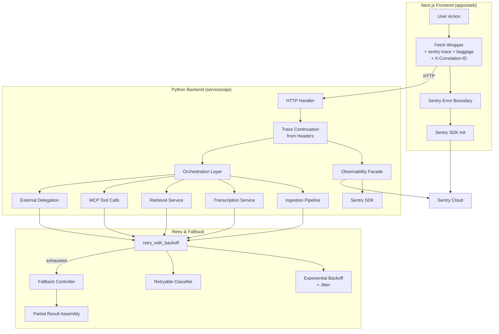
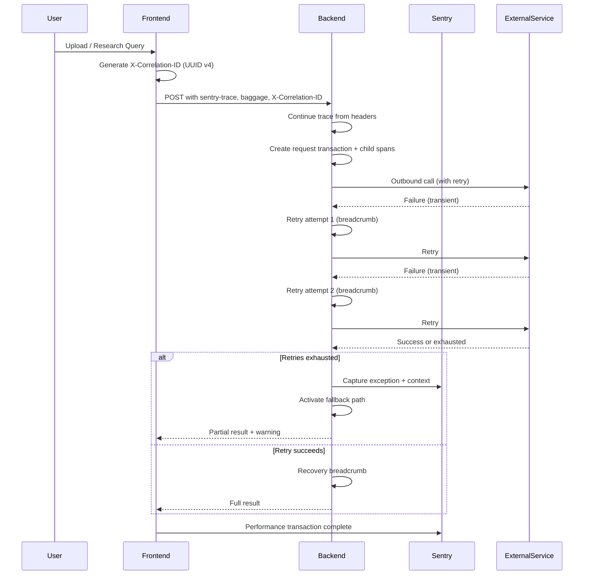

# Design Document: Observability and Recovery

## Overview

This design integrates Sentry-based observability and intelligent recovery logic across the Omni-Modal Enterprise Research Orchestrator's full stack. The system captures structured errors, performance traces, and breadcrumbs from both the Next.js frontend and the Python backend, enabling operators to diagnose failures across the distributed request path. A complementary retry-with-backoff mechanism handles transient failures, while fallback paths ensure graceful degradation when primary operations fail permanently.

### Design Goals

1. **Full-stack traceability**: Link frontend user actions to backend processing via distributed tracing (`sentry-trace` / `baggage` headers).
2. **Actionable context**: Every captured error includes domain-specific identifiers (tenant, document, query, tool) enabling fast root-cause identification.
3. **Privacy by default**: PII scrubbing is applied before any payload leaves the application boundary.
4. **Graceful degradation**: Retry transient failures transparently; when retries are exhausted, activate fallback paths that return partial results rather than hard errors.
5. **Zero-disruption observability**: If Sentry is unavailable or misconfigured, the application operates without error or performance penalty.

### Key Design Decisions

| Decision | Rationale |
|----------|-----------|
| Use `@sentry/nextjs` SDK for frontend | Official Next.js integration handles App Router, RSC, and API routes out-of-the-box |
| Keep existing `Observability` class as single backend facade | Avoids scattering Sentry imports; simplifies testing via a single mock point |
| Enhance existing `retry_with_backoff` decorator | Already integrated with breadcrumbs; extend with jitter, Retry-After support, and retryable classification |
| Place correlation-ID generation in frontend fetch wrapper | Ensures every request gets a UUID before it leaves the browser |
| Implement fallback logic at orchestration layer | Orchestrator has visibility into all sub-steps and can decide to proceed with partial results |

## Architecture

### High-Level Data Flow



### Component Interaction Sequence



## Components and Interfaces

### Frontend Components

#### 1. Sentry Initialization (`apps/web/src/lib/sentry.ts`)

```typescript
import * as Sentry from "@sentry/nextjs";

export function initSentry(): void {
  const dsn = process.env.NEXT_PUBLIC_SENTRY_DSN;
  if (!dsn) return;

  try {
    new URL(dsn); // validate DSN format
  } catch {
    console.warn("[Sentry] Malformed NEXT_PUBLIC_SENTRY_DSN, Sentry disabled.");
    return;
  }

  Sentry.init({
    dsn,
    environment: process.env.NEXT_PUBLIC_SENTRY_ENVIRONMENT ?? "development",
    tracesSampleRate: 1.0,
    integrations: [Sentry.browserTracingIntegration()],
  });
}
```

#### 2. Error Boundary Component (`apps/web/src/components/sentry-error-boundary.tsx`)

```typescript
interface SentryErrorBoundaryProps {
  children: React.ReactNode;
  fallback?: React.ReactNode;
}

// Uses @sentry/nextjs ErrorBoundary that captures React rendering errors
// Displays a fallback UI with an error message and a "Try Again" button
// The retry action calls router.refresh() or re-mounts the subtree
```

#### 3. Instrumented Fetch Wrapper (`apps/web/src/lib/api-client.ts`)

```typescript
export interface ApiClientOptions {
  baseUrl?: string;
  timeout?: number; // default: 30_000ms
}

export async function apiRequest(
  path: string,
  init?: RequestInit,
  options?: ApiClientOptions
): Promise<Response> {
  // 1. Generate X-Correlation-ID (crypto.randomUUID())
  // 2. Attach sentry-trace and baggage headers via Sentry.getActiveSpan()
  // 3. Set AbortController timeout
  // 4. On failure: capture to Sentry with context (path, status, file metadata)
  // 5. Return response
}
```

### Backend Components

#### 4. Enhanced Observability Facade (`services/api/src/omni_modal/observability.py`)

Extended interface (additions to existing class):

```python
class Observability:
    # Existing methods: init, capture_exception, capture_message, add_breadcrumb,
    #                   set_user, set_tag, span, flush

    # NEW: Continue trace from incoming request headers
    def continue_trace(self, headers: dict[str, str]) -> ContextManager:
        """Start or continue a distributed trace from sentry-trace/baggage headers."""
        ...

    # NEW: Create child spans for sub-operations
    def child_span(self, operation: str, description: str) -> ContextManager:
        """Create a child span nested under the current transaction."""
        ...

    # NEW: Set request-scoped tags (tenant_id, user_id)
    def set_request_scope(self, tenant_id: str, user_id: str | None = None) -> None:
        """Attach tenant/user as Sentry tags for the current scope."""
        ...

    # ENHANCED: PII scrubbing applied to breadcrumb data and context values
    def scrub_pii(self, data: dict[str, Any]) -> dict[str, Any]:
        """Remove passwords, tokens, URLs, emails from arbitrary dicts."""
        ...
```

#### 5. Enhanced Retry Decorator (`services/api/src/omni_modal/retry.py`)

Extended signature:

```python
def retry_with_backoff(
    func: Callable[..., T] | None = None,
    *,
    max_retries: int = 3,
    base_delay: float = 1.0,           # seconds
    max_total_delay: float = 30.0,     # seconds, NEW
    jitter_factor: float = 0.25,       # NEW: random jitter up to 25%
    retryable_exceptions: tuple[type[BaseException], ...] = (Exception,),
    retryable: Callable[[BaseException], bool] | None = None,
    respect_retry_after: bool = True,  # NEW: honor Retry-After header
) -> Callable[[Callable[..., T]], Callable[..., T]]:
    """Retry with exponential backoff, jitter, and optional Retry-After support."""
    ...
```

Key algorithm for delay calculation:

```python
def compute_delay(attempt: int, base_delay: float, jitter_factor: float) -> float:
    exponential = base_delay * (2 ** attempt)
    jitter = random.uniform(0, jitter_factor * exponential)
    return exponential + jitter
```

#### 6. Retryable Exception Classifier (`services/api/src/omni_modal/retry.py`)

```python
def is_retryable(exc: BaseException) -> bool:
    """Classify exceptions as retryable or non-retryable.

    Retryable:
      - ConnectionError, TimeoutError
      - HTTP 429, 502, 503, 504
      - Database connection timeout

    Non-retryable:
      - HTTP 400, 401, 403
      - ValidationError
      - FileFormatError
    """
    ...
```

#### 7. Fallback Controller (`services/api/src/omni_modal/orchestration/fallbacks.py`)

```python
@dataclass
class FallbackWarning:
    source: str          # e.g., "external_delegation", "retrieval", "transcription"
    reason: str          # Human-readable failure reason
    exception_type: str  # e.g., "TimeoutError"

@dataclass
class OrchestrationResult:
    response: ResearchResponse
    warnings: list[FallbackWarning]
    skipped_tools: list[dict[str, str]]  # [{name, reason}]
    partial: bool

class FallbackController:
    def handle_delegation_failure(self, exc: BaseException, request_id: str) -> FallbackWarning:
        """Return warning for failed external delegation."""
        ...

    def handle_retrieval_failure(self, exc: BaseException, query: str) -> FallbackWarning:
        """Return warning for failed retrieval."""
        ...

    def handle_transcription_failure(self, exc: BaseException, stage: str) -> FallbackWarning:
        """Return warning for failed transcription."""
        ...

    def handle_tool_failure(self, exc: BaseException, tool_name: str) -> dict[str, str]:
        """Return skipped tool entry for failed MCP tool call."""
        ...
```

#### 8. PII Scrubber (`services/api/src/omni_modal/observability.py`)

```python
import re

_PII_PATTERNS = [
    re.compile(r"[a-zA-Z0-9._%+-]+@[a-zA-Z0-9.-]+\.[a-zA-Z]{2,}"),  # email
    re.compile(r"(?:password|secret|token|key)\s*[:=]\s*\S+", re.IGNORECASE),
    re.compile(r"[a-zA-Z]+://[^\s]+"),  # URLs / connection strings
]

def scrub_value(value: str) -> str:
    """Replace PII patterns in a string with '<redacted>'."""
    for pattern in _PII_PATTERNS:
        value = pattern.sub("<redacted>", value)
    return value
```

### Integration Points

| Component | Integrates With | Mechanism |
|-----------|----------------|-----------|
| Frontend Fetch Wrapper | Backend HTTP Handler | `sentry-trace`, `baggage`, `X-Correlation-ID` headers |
| Backend HTTP Handler | Observability Facade | `continue_trace()` on request entry |
| Ingestion Pipeline | Retry Decorator | `@retry_with_backoff` on extraction and embedding calls |
| Retrieval Service | Retry Decorator + Observability | Retry on DB connection errors; breadcrumbs per stage |
| External Delegation | Retry Decorator + Fallback Controller | Retry transient HTTP errors; fallback to internal-only result |
| MCP Tool Calls | Retry Decorator + Fallback Controller | Retry timeouts; skip failed tools |
| Orchestration Workflow | Fallback Controller | Aggregate warnings; return partial results |

## Data Models

### Sentry Context Structures

```python
# Ingestion error context
@dataclass
class IngestionErrorContext:
    document_id: str
    tenant_id: str
    source_type: str
    file_size_bytes: int
    file_name: str
    stage: str              # extraction, normalization, chunking, embedding
    chunk_index: int | None # for chunking failures

# Transcription error context
@dataclass
class TranscriptionErrorContext:
    model_name: str
    file_extension: str
    file_size_bytes: int
    audio_duration: str      # from metadata or "unknown"
    available_memory_bytes: int | None
    elapsed_seconds: float | None
    phase: str               # model_load, audio_decode, transcription

# Retrieval error context
@dataclass
class RetrievalErrorContext:
    tenant_id: str
    query_length: int
    embedding_model: str
    error_category: str      # connection_error, query_error, embedding_error
    top_k: int | None
    similarity_threshold: float | None

# Tool call error context
@dataclass
class ToolCallErrorContext:
    tool_name: str
    tenant_id: str
    actor_user_id: str
    elapsed_ms: float | None
    timeout_ms: float | None
    scrubbed_params: str     # PII-scrubbed, truncated to 1024 chars

# External delegation error context
@dataclass
class DelegationErrorContext:
    endpoint_host: str       # host only, no path
    request_id: str
    error_type: str          # connection_refused, dns_failure, timeout, http_error, parse_error
    http_status: int | None
    elapsed_ms: float | None
    timeout_ms: float | None
    response_preview: str | None  # first 500 chars

# Agent timeout context
@dataclass
class AgentTimeoutContext:
    step_name: str
    elapsed_ms: float
    timeout_limit_ms: float
    completed_steps: list[dict[str, float]]  # [{name, duration_ms}]
    in_progress_step: str | None
```

### Retry Configuration Model

```python
@dataclass(frozen=True)
class RetryConfig:
    max_retries: int = 3
    base_delay_ms: float = 1000.0
    max_total_delay_ms: float = 30_000.0
    jitter_factor: float = 0.25
    respect_retry_after: bool = True
```

### Frontend Response Models (TypeScript)

```typescript
interface PartialResultResponse {
  // Standard response fields...
  partial: boolean;
  warnings: Array<{
    source: string;    // "external_delegation" | "retrieval" | "transcription"
    reason: string;
  }>;
  skipped_tools: Array<{
    name: string;
    reason: string;
  }>;
}
```

### Environment Variables

| Variable | Layer | Required | Default | Description |
|----------|-------|----------|---------|-------------|
| `NEXT_PUBLIC_SENTRY_DSN` | Frontend | No | — | Sentry DSN for browser SDK |
| `NEXT_PUBLIC_SENTRY_ENVIRONMENT` | Frontend | No | `"development"` | Environment tag |
| `SENTRY_DSN` | Backend | No | — | Sentry DSN for Python SDK |
| `SENTRY_TRACES_SAMPLE_RATE` | Backend | No | `0.1` | Trace sampling rate (0.0–1.0) |
| `ENVIRONMENT` | Backend | No | `"development"` | Environment tag |

## Correctness Properties

*A property is a characteristic or behavior that should hold true across all valid executions of a system—essentially, a formal statement about what the system should do. Properties serve as the bridge between human-readable specifications and machine-verifiable correctness guarantees.*

### Property 1: PII Scrubbing Completeness

*For any* string containing one or more PII patterns (email addresses, URLs/connection strings, password/secret/token key-value pairs), after applying `scrub_value()`, the output string SHALL NOT contain any of the original PII pattern matches, and all non-PII text segments SHALL be preserved unchanged.

**Validates: Requirements 2.5, 6.5**

### Property 2: Exponential Backoff with Jitter Bounds

*For any* base delay > 0, attempt number in [0, max_retries), and jitter factor in [0, 1], the computed delay SHALL satisfy: `base_delay * 2^attempt <= actual_delay <= base_delay * 2^attempt * (1 + jitter_factor)`.

**Validates: Requirements 9.1, 9.7**

### Property 3: Retryable Exception Classification Correctness

*For any* exception instance, `is_retryable()` SHALL return `True` if and only if the exception is a ConnectionError, TimeoutError, HTTP 429 response, HTTP 502/503/504 response, or database connection timeout; and SHALL return `False` for HTTP 400 responses, HTTP 401/403 responses, ValidationError, and FileFormatError.

**Validates: Requirements 9.4, 9.5**

### Property 4: Retry-After Header Override

*For any* HTTP 429 response that includes a numeric Retry-After header value, if that value does not exceed the configured `max_total_delay`, the retry decorator SHALL use the Retry-After value as the next delay instead of the computed exponential backoff value.

**Validates: Requirements 9.8**

### Property 5: Retry Breadcrumb Count Matches Attempt Count

*For any* `max_retries` configuration value N where the decorated function fails on every call, the total number of recorded breadcrumbs SHALL equal N (one per retry attempt after the initial call), and the final exception capture SHALL include `attempts = N` in its context.

**Validates: Requirements 9.2, 9.3**

### Property 6: String Truncation Preserves Prefix

*For any* input string of length L, when truncated to a limit K: if L <= K the output SHALL equal the input; if L > K the output SHALL equal the first K characters of the input. This applies to tool call breadcrumb params (K=256), tool call error messages (K=512), and delegation response previews (K=500).

**Validates: Requirements 6.3, 6.4, 8.3**

### Property 7: URL Host Extraction

*For any* valid URL string (with scheme, host, optional port, optional path, optional query), the `extract_host()` function SHALL return only the host (and port if non-default), discarding the scheme, path, query parameters, and fragment.

**Validates: Requirements 8.1, 8.2, 8.4**

### Property 8: Ingestion Observability Context Completeness

*For any* document with a random document_id, tenant_id, source_type, file_name, and file_size, when the ingestion pipeline records a failure at any stage (extraction, normalization, chunking, embedding), the captured Sentry context SHALL include all of: document_id, tenant_id, source_type, and file_size; and if the failure occurs during chunking, SHALL additionally include the chunk_index.

**Validates: Requirements 3.1, 3.2, 3.3, 3.4**

### Property 9: Frontend Outbound Request Headers

*For any* API request made through the frontend fetch wrapper, the outgoing request SHALL include: (a) an `X-Correlation-ID` header whose value is a valid UUID v4 string, (b) a `sentry-trace` header, and (c) a `baggage` header.

**Validates: Requirements 11.4, 12.1**

### Property 10: Frontend Error Capture Context Completeness

*For any* failed API request (upload or research query) with a known file_name/file_size or query_length, and a response HTTP status code (or "network_error"), the Sentry capture context SHALL include all applicable metadata fields matching the request type.

**Validates: Requirements 11.1, 11.2**

### Property 11: Fallback Warning Aggregation

*For any* subset of subsystems that fail within a single orchestration request (from the set: external_delegation, retrieval, transcription, tool_call), the response `warnings` array SHALL contain exactly one entry per failed subsystem with the correct `source` identifier, and the `skipped_tools` array SHALL contain one entry per failed tool with name and reason.

**Validates: Requirements 10.4, 10.6**

### Property 12: Transcription Failure Message Completeness

*For any* transcription failure at a given stage (model_load, decode, or timeout) with a given exception type name, the resulting error message SHALL contain both the stage name string and the exception type name string.

**Validates: Requirements 4.2, 10.2**

### Property 13: Orchestration Step Breadcrumb Symmetry

*For any* sequence of orchestration workflow steps that execute successfully, the recorded breadcrumbs SHALL contain exactly one "start" and one "complete" entry per step, with matching step names. If a step fails, there SHALL be a "start" breadcrumb and a "failed" breadcrumb (no "complete"), and the failed breadcrumb SHALL include elapsed_ms and failure reason.

**Validates: Requirements 7.2**

### Property 14: Orchestration Timeout Context Completeness

*For any* orchestration workflow that times out, with a list of N completed steps (each having a name and duration) and one in-progress step, the captured timeout event context SHALL include: all N completed step entries with correct names and durations, the in-progress step name, the total elapsed_ms, and the configured timeout_limit_ms.

**Validates: Requirements 7.1, 7.3**

### Property 15: Retrieval Failure Classification

*For any* vector search failure caused by either a connection error or a query execution error, the captured Sentry context SHALL include a `failure_classification` field whose value is `"connection_error"` if the exception is a connection/timeout error, or `"query_error"` otherwise.

**Validates: Requirements 5.2**

### Property 16: Backend Trace Continuation

*For any* valid `sentry-trace` header value (format: `{trace_id}-{span_id}-{sampled}`), the backend SHALL create a transaction whose trace_id matches the incoming header's trace_id, establishing parent-child linkage with the frontend span.

**Validates: Requirements 12.2**

## Error Handling

### Error Categories and Response Strategy

| Error Category | Retry? | Fallback? | User-Facing Response |
|----------------|--------|-----------|---------------------|
| Network errors (connection, DNS, reset) | Yes (up to 3) | Yes | Partial result with warning |
| HTTP 429 (rate limit) | Yes (with Retry-After) | Yes | Partial result with warning |
| HTTP 502/503/504 (gateway) | Yes (up to 3) | Yes | Partial result with warning |
| DB connection timeout | Yes (up to 3) | Yes | Partial result with warning |
| HTTP 400 (bad request) | No | No | Immediate 400 to caller |
| HTTP 401/403 (auth) | No | No | Immediate 401/403 to caller |
| Validation errors | No | No | Immediate 400 with details |
| File format errors | No | No | Mark document as "failed" |
| Sentry SDK failure | N/A | N/A | Invisible — app continues |

### Sentry Unavailability

All observability operations are guarded by the `Observability._sentry is None` check. If Sentry is unavailable:
- No exceptions are raised from observability calls
- Application logic continues uninterrupted
- Errors are logged to the local application logger as a secondary record

### Shutdown Behavior

On backend shutdown:
1. `observability.flush(timeout=2.0)` is called via `atexit`
2. If flush times out, shutdown proceeds without error
3. No pending Sentry events block the process exit

### Frontend Error Boundary Behavior

When a React rendering error is caught:
1. Error is captured to Sentry (async, non-blocking)
2. Fallback UI is displayed with:
   - A message indicating something went wrong
   - A "Try Again" button that calls `router.refresh()` (no full page reload)
   - A "Go Home" link as an alternative navigation path

## Testing Strategy

### Property-Based Testing

**Library**: `hypothesis` (Python backend), `fast-check` (TypeScript frontend)

Property-based tests are the primary validation mechanism for the pure logic components of this feature. Each property test runs a minimum of 100 iterations.

**Backend Properties (Python / Hypothesis)**:
- Property 1: PII scrubbing — generate strings with embedded emails, URLs, secrets
- Property 2: Exponential backoff bounds — generate (base_delay, attempt, jitter_factor) tuples
- Property 3: Retryable classification — generate exceptions from both retryable and non-retryable sets
- Property 4: Retry-After override — generate Retry-After values within/outside max bounds
- Property 5: Retry breadcrumb count — generate max_retries values, simulate failures
- Property 6: String truncation — generate strings of length 0..2000, verify truncation at various limits
- Property 7: URL host extraction — generate valid URLs with varied schemes/hosts/ports/paths
- Property 8: Ingestion context completeness — generate random document metadata
- Property 11: Fallback aggregation — generate subsets of failing subsystems
- Property 12: Transcription failure message — generate stage names and exception type names
- Property 13: Orchestration breadcrumb symmetry — generate step sequences with success/failure
- Property 14: Orchestration timeout context — generate completed step lists
- Property 15: Retrieval failure classification — generate connection vs query exceptions

**Frontend Properties (TypeScript / fast-check)**:
- Property 9: Outbound request headers — generate request paths, verify headers
- Property 10: Frontend error capture context — generate file metadata and status codes
- Property 16: Trace continuation — generate valid sentry-trace header values

**Tag format**: `Feature: observability-and-recovery, Property {N}: {title}`

### Unit Tests (Example-Based)

Unit tests cover specific scenarios, edge cases, and integration behavior:

- Sentry init with valid DSN (smoke)
- Sentry init with missing DSN (no error)
- Sentry init with malformed DSN (warning logged)
- Error boundary renders fallback UI on throw
- API route error captures route path as tag
- Retry recovery breadcrumb after partial failure
- External delegation fallback returns internal result with warning
- Retrieval failure returns partial-result response
- Tool timeout captures correct elapsed_ms
- Sentry SDK failure doesn't crash application
- Backend shutdown flush within timeout

### Integration Tests

- End-to-end distributed trace: frontend request → backend transaction → child spans
- Full retry sequence: transient failure → retry → success (or exhaust → fallback)
- Multiple fallback activation in single request
- Sentry trace continuation from valid headers
- Sentry new root transaction from malformed headers

### Test File Organization

```
services/api/tests/
├── test_observability.py          # Unit tests for observability facade
├── test_retry.py                  # Property + unit tests for retry logic
├── test_pii_scrubbing.py         # Property tests for PII scrubbing
├── test_fallbacks.py             # Property + unit tests for fallback controller
├── test_ingestion_observability.py # Property tests for ingestion context
├── test_orchestration_tracing.py  # Property tests for step breadcrumbs/timeouts

apps/web/src/__tests__/
├── sentry-init.test.ts           # Unit tests for Sentry initialization
├── api-client.test.ts            # Property tests for fetch wrapper headers
├── error-boundary.test.tsx       # Unit test for error boundary component
├── error-capture.test.ts         # Property tests for frontend error capture
```

