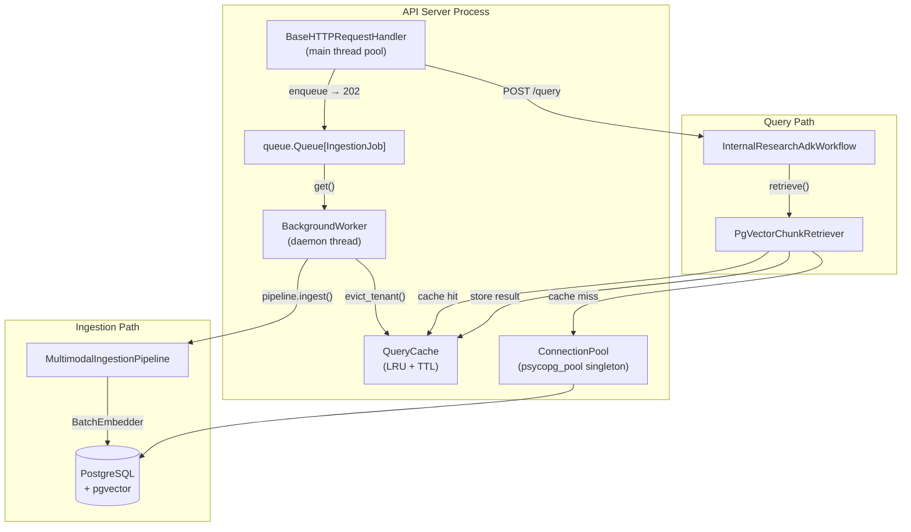

# Design Document — Performance and Scalability (Phase 11)

## Overview

Phase 11 introduces five targeted optimisations to the Omni-Modal Enterprise Research Orchestrator:

1. **Async background ingestion** — moves `MultimodalIngestionPipeline.ingest()` off the HTTP handler thread via a `threading.Thread`-based `BackgroundWorker` consuming from a `queue.Queue`.
2. **Connection pooling** — replaces the per-request `psycopg.connect()` in `PgVectorChunkRetriever` with a module-level `psycopg_pool.ConnectionPool` singleton.
3. **Query result caching** — wraps retrieval results in an in-process `QueryCache` keyed on a SHA-256 hash of the normalised query signature, with LRU eviction and TTL expiry.
4. **Batch embedding writes** — introduces a `BatchEmbedder` that accumulates `StructuredChunk` objects and writes them to `embeddings` and `document_chunks` in configurable-size batches using `executemany` with `INSERT … ON CONFLICT DO UPDATE`.
5. **HNSW index tuning + covering index** — a new migration (`0002_perf.sql`) sets `m`, `ef_construction`, and `hnsw.ef_search` and adds a `(tenant_id, document_id)` covering index on `embeddings`.

A benchmark harness (`python -m omni_modal.benchmark`) measures end-to-end retrieval latency (p50/p95/p99) and ingestion throughput before and after each optimisation.

### Guiding Principles

- **No external dependencies for runtime hot paths** — caching and queuing are in-process; no Redis, no Celery.
- **Backwards compatibility** — all optimisations are introduced behind environment-variable feature flags so existing tests continue to pass.
- **Measured, not speculative** — the benchmark harness documents baseline numbers; optimisations are gated on those measurements.
- **Single process** — the `BackgroundWorker` runs as a daemon thread in the same process as the HTTP server, keeping the deployment model simple.

---

## Architecture



The key architectural decisions are:

| Decision | Alternative considered | Rationale |
|---|---|---|
| `threading.Thread` + `queue.Queue` | `asyncio` event loop | `BaseHTTPRequestHandler` is synchronous; converting to `asyncio` would require replacing the server entirely. A single daemon thread is the minimal, safe change. |
| `psycopg_pool.ConnectionPool` | `asyncpg` / `databases` | `psycopg3` is already in use; `psycopg_pool` is the official companion library. |
| `cachetools.TTLCache` inside `QueryCache` | Redis | Zero external dependencies; 256-entry LRU fits comfortably in-process for a single-node deployment. |
| `executemany` with VALUES batching | `copy_from` / COPY | `executemany` with `ON CONFLICT DO UPDATE` is safe for re-ingestion; COPY does not support upsert natively. |
| Single migration file `0002_perf.sql` | Drizzle migration | The Python service owns the performance-tuning migration; Drizzle manages the schema baseline. |

---

## Components and Interfaces

### 2.1 BackgroundWorker (`ingestion/worker.py`)

```python
import queue
import threading
import logging
from dataclasses import replace
from omni_modal.ingestion.models import IngestionErrorCode, IngestionJob
from omni_modal.ingestion.pipeline import MultimodalIngestionPipeline
from omni_modal.observability import observability

logger = logging.getLogger(__name__)

class BackgroundWorker:
    """Daemon thread that drains a queue.Queue[IngestionJob] one job at a time."""

    def __init__(
        self,
        pipeline: MultimodalIngestionPipeline,
        job_queue: "queue.Queue[IngestionJob]",
        jobs_store: "dict[str, IngestionJob]",
        *,
        watchdog_callback: "Callable[[BaseException], None] | None" = None,
    ) -> None: ...

    def start(self) -> None:
        """Start the daemon thread.  Idempotent — safe to call multiple times."""
        ...

    def stop(self, timeout: float = 5.0) -> None:
        """Signal the worker to drain and stop, then join the thread."""
        ...

    def _run(self) -> None:
        """Main loop — runs on the daemon thread."""
        while not self._stop_event.is_set():
            try:
                job: IngestionJob = self._queue.get(timeout=1.0)
            except queue.Empty:
                continue
            self._process_one(job)

    def _process_one(self, job: IngestionJob) -> None:
        """Process a single job; update jobs_store with final status."""
        ...
```

**Key properties:**
- The `threading.Thread` is created with `daemon=True` so it does not prevent process exit.
- `_stop_event: threading.Event` is checked each iteration; the loop exits cleanly on `stop()`.
- Unrecoverable exceptions inside `_process_one` are caught; the job is transitioned to `"failed"` with `error_code` and `error_message`; the thread continues.
- A watchdog callback (injected by `main.py`) is called on unexpected thread death so that `main.py` can restart the worker within 5 s (Requirement 8.3).

### 2.2 AsyncIngestionQueue (`ingestion/async_queue.py`)

Replaces `InMemoryIngestionQueue` for Phase 11. Retains the same `enqueue` / `get` / `fail` interface but adds `enqueue_async` and delegates processing to `BackgroundWorker`.

```python
class AsyncIngestionQueue:
    def __init__(
        self,
        pipeline: MultimodalIngestionPipeline,
        *,
        max_queue_size: int = 0,          # 0 = unbounded
    ) -> None: ...

    def enqueue(self, request: IngestionRequest) -> IngestionJob:
        """Create a job, store it, push it onto the queue, return immediately."""
        ...

    def get(self, job_id: str) -> IngestionJob | None:
        """Return current job state (thread-safe read)."""
        ...

    def fail(
        self,
        job_id: str,
        error_code: IngestionErrorCode,
        error_message: str,
    ) -> IngestionJob:
        """Explicitly fail a job (used by tests and error injection)."""
        ...

    def start_worker(self) -> BackgroundWorker:
        """Create and start the BackgroundWorker daemon thread."""
        ...
```

The `_jobs: dict[str, IngestionJob]` dictionary is protected by a `threading.Lock` for all reads and writes.

### 2.3 ConnectionPool singleton (`db/pool.py`)

```python
import os
import threading
from psycopg_pool import ConnectionPool   # type: ignore[import-not-found]

_pool: ConnectionPool | None = None
_pool_lock = threading.Lock()

def get_connection_pool() -> ConnectionPool:
    """Lazy-initialise and return the module-level singleton pool.

    Reads DB_POOL_MIN (default 2) and DB_POOL_MAX (default 10) from env.
    Raises RuntimeError if DATABASE_URL is not set.
    """
    global _pool
    if _pool is not None:
        return _pool
    with _pool_lock:
        if _pool is not None:
            return _pool
        database_url = os.environ.get("DATABASE_URL")
        if not database_url:
            raise RuntimeError("DATABASE_URL environment variable is required.")
        min_size = int(os.environ.get("DB_POOL_MIN", "2"))
        max_size = int(os.environ.get("DB_POOL_MAX", "10"))
        _pool = ConnectionPool(
            conninfo=database_url,
            min_size=min_size,
            max_size=max_size,
            timeout=5.0,          # Requirement 3.3: wait up to 5 s
            reconnect_failed=_on_reconnect_failed,
        )
    return _pool


def _on_reconnect_failed(pool: ConnectionPool) -> None:
    observability.capture_message(
        "ConnectionPool reconnect failed",
        operation="db.pool.reconnect_failed",
        level="error",
    )


def close_connection_pool() -> None:
    """Close the pool on shutdown (registered with atexit in main.py)."""
    global _pool
    if _pool is not None:
        _pool.close()
        _pool = None
```

`get_connection_pool()` is called once in `main.py` at startup; the returned object is injected into `PgVectorChunkRetriever` and `BatchEmbedder`.

### 2.4 QueryCache (`qa/cache.py`)

```python
import hashlib
import json
import threading
from typing import Callable
from cachetools import TTLCache     # type: ignore[import-not-found]
from omni_modal.qa.models import QueryRequest, RetrievedChunk

CacheKey = str

class QueryCache:
    """Thread-safe LRU + TTL cache for retrieval results.

    Uses cachetools.TTLCache under the hood. The cache is keyed on a
    SHA-256 digest of (question_normalised, tenant_id, top_k, min_similarity).
    """

    def __init__(
        self,
        *,
        maxsize: int = 256,
        ttl: float = 300.0,
        enabled: bool = True,
    ) -> None: ...

    @staticmethod
    def compute_key(
        question: str,
        tenant_id: str,
        top_k: int,
        min_similarity: float,
    ) -> CacheKey:
        """Return the SHA-256 hex digest of the canonical key tuple.

        ``question`` is lower-cased and stripped before hashing so that
        trivially equivalent queries share a cache entry.
        """
        normalized = question.lower().strip()
        raw = json.dumps(
            [normalized, tenant_id, top_k, min_similarity],
            separators=(",", ":"),
            sort_keys=True,
        ).encode()
        return hashlib.sha256(raw).hexdigest()

    def get(self, key: CacheKey) -> list[RetrievedChunk] | None:
        """Return cached chunks or None on miss / disabled."""
        ...

    def set(self, key: CacheKey, chunks: list[RetrievedChunk]) -> None:
        """Store chunks under key; no-op when disabled."""
        ...

    def evict_tenant(self, tenant_id: str) -> int:
        """Remove all entries whose key was derived from tenant_id.

        Returns the number of evicted entries.

        Implementation note: TTLCache does not support partial scan by
        construction. The cache stores a secondary index
        ``_tenant_keys: dict[str, set[CacheKey]]`` updated on every set().
        evict_tenant() iterates that set and deletes matching keys.
        """
        ...

    def __len__(self) -> int: ...
```

`QueryCache` is thread-safe via an internal `threading.Lock` wrapping all `TTLCache` mutations.

`enabled` is set from `os.environ.get("QUERY_CACHE_ENABLED", "true").lower() != "false"` at construction time in `main.py`.

### 2.5 Updated PgVectorChunkRetriever (`qa/retrieval.py`)

The constructor gains two optional parameters:

```python
class PgVectorChunkRetriever:
    def __init__(
        self,
        embedding_provider: QueryEmbeddingProvider,
        database_url: str | None = None,
        *,
        pool: "ConnectionPool | None" = None,
        cache: "QueryCache | None" = None,
    ) -> None: ...
```

- When `pool` is provided, connections are acquired with `pool.connection()` context manager instead of `psycopg.connect()`.
- When `cache` is provided and enabled, `retrieve()` checks the cache before querying the DB and writes results back after a miss.

The retrieval logic becomes:

```python
def retrieve(self, request: QueryRequest) -> list[RetrievedChunk]:
    if self._cache is not None:
        key = QueryCache.compute_key(
            request.question, request.tenant_id, request.top_k, request.min_similarity
        )
        cached = self._cache.get(key)
        if cached is not None:
            return cached

    # ... existing embed + search logic, using pool.connection() instead of psycopg.connect() ...

    if self._cache is not None:
        self._cache.set(key, results)
    return results
```

### 2.6 BatchEmbedder (`ingestion/batch_embedder.py`)

```python
from __future__ import annotations
import math
from typing import Sequence
from psycopg_pool import ConnectionPool   # type: ignore[import-not-found]
from omni_modal.ingestion.models import StructuredChunk

class BatchEmbedder:
    """Writes StructuredChunk rows to embeddings + document_chunks in batches.

    All batches for a single document are written inside one transaction.
    Uses INSERT … ON CONFLICT DO UPDATE for idempotent re-ingestion.
    """

    def __init__(
        self,
        pool: ConnectionPool,
        *,
        batch_size: int = 64,
        embedding_model: str = "hashing-placeholder",
        dimensions: int = 1536,
    ) -> None: ...

    def write_chunks(
        self,
        tenant_id: str,
        document_id: str,
        chunks: Sequence[StructuredChunk],
        embeddings: Sequence[list[float]],
    ) -> int:
        """Write all chunks + embeddings within a single transaction.

        Returns the total number of rows inserted/updated.
        Raises BatchInsertError on row-count mismatch after any batch.
        """
        ...

    def _batches(
        self,
        items: Sequence[object],
    ) -> list[list[object]]:
        """Split items into sub-lists of at most batch_size elements."""
        n = len(items)
        return [
            list(items[i : i + self._batch_size])
            for i in range(0, n, self._batch_size)
        ]

    def _insert_chunk_batch(
        self,
        cursor: "psycopg.Cursor",
        tenant_id: str,
        document_id: str,
        batch: list[StructuredChunk],
    ) -> int:
        """Execute upsert for one chunk batch; return rowcount."""
        ...

    def _insert_embedding_batch(
        self,
        cursor: "psycopg.Cursor",
        tenant_id: str,
        document_id: str,
        chunk_ids: list[str],
        batch: list[list[float]],
    ) -> int:
        """Execute upsert for one embedding batch; return rowcount."""
        ...
```

SQL template for chunk upsert:

```sql
INSERT INTO document_chunks
  (id, tenant_id, document_id, chunk_index, content, content_hash, metadata)
VALUES %s
ON CONFLICT (document_id, chunk_index) DO UPDATE
  SET content      = EXCLUDED.content,
      content_hash = EXCLUDED.content_hash,
      metadata     = EXCLUDED.metadata
```

SQL template for embedding upsert:

```sql
INSERT INTO embeddings
  (id, tenant_id, document_id, chunk_id, embedding, embedding_model, dimensions)
VALUES %s
ON CONFLICT (chunk_id) DO UPDATE
  SET embedding       = EXCLUDED.embedding,
      embedding_model = EXCLUDED.embedding_model
```

`BatchInsertError` is raised when `cursor.rowcount != len(batch)`.

### 2.7 Benchmark Harness (`benchmark/__main__.py`)

```python
"""
Benchmark harness for Phase 11.

Usage:
    python -m omni_modal.benchmark [--queries 100] [--docs 10] [--output results.json]

Environment:
    DATABASE_URL  — required
"""
import argparse
import json
import statistics
import time
from dataclasses import dataclass
from pathlib import Path

@dataclass
class BenchmarkStats:
    timestamp: str
    retrieval_p50_ms: float
    retrieval_p95_ms: float
    retrieval_p99_ms: float
    ingestion_docs_per_minute: float

def run_retrieval_benchmark(
    retriever: "ChunkRetriever",
    queries: list[str],
    tenant_id: str,
) -> BenchmarkStats:
    """Execute queries sequentially, collect latencies, return percentile stats."""
    ...

def run_ingestion_benchmark(
    queue: "AsyncIngestionQueue",
    test_files: list[Path],
    tenant_id: str,
) -> float:
    """Ingest test_files sequentially; return documents per minute."""
    ...

def serialise_stats(stats: BenchmarkStats) -> dict[str, object]:
    """Return a JSON-serialisable dict with the five required fields."""
    return {
        "timestamp":               stats.timestamp,
        "retrieval_p50_ms":        stats.retrieval_p50_ms,
        "retrieval_p95_ms":        stats.retrieval_p95_ms,
        "retrieval_p99_ms":        stats.retrieval_p99_ms,
        "ingestion_docs_per_minute": stats.ingestion_docs_per_minute,
    }

def main() -> None: ...

if __name__ == "__main__":
    main()
```

---

## Data Models

### 3.1 Job State Machine

```
uploaded ──► processing ──► ready
                 │
                 └──► failed
```

`JobStatus` is already defined in `ingestion/models.py`. The `AsyncIngestionQueue` transitions jobs atomically under its internal `threading.Lock`.

### 3.2 CacheKey

`CacheKey = str` — a 64-character lowercase hex SHA-256 digest. No separate model needed.

### 3.3 BenchmarkStats

```python
@dataclass
class BenchmarkStats:
    timestamp: str                     # ISO-8601 UTC
    retrieval_p50_ms: float
    retrieval_p95_ms: float
    retrieval_p99_ms: float
    ingestion_docs_per_minute: float
```

### 3.4 Database Migration `0002_perf.sql`

```sql
-- 0002_perf.sql — HNSW tuning + covering index
-- Parameters: m=16, ef_construction=64, ef_search=40
-- NOTE: recall/latency for this config have NOT been measured against a real
-- corpus. Run `python -m omni_modal.benchmark` against a populated DB first.

-- Drop and recreate HNSW index with explicit tuning parameters
DROP INDEX IF EXISTS embeddings_vector_hnsw_idx;

CREATE INDEX embeddings_vector_hnsw_idx
  ON embeddings
  USING hnsw (embedding vector_cosine_ops)
  WITH (m = 16, ef_construction = 64);

-- Session-level ef_search default (override per-query if needed)
ALTER DATABASE current_database() SET hnsw.ef_search = 40;

-- Covering index to eliminate heap fetch for tenant filter
-- INCLUDE(document_id) means the planner can satisfy the tenant+doc filter
-- from the index alone without a heap lookup.
CREATE INDEX IF NOT EXISTS embeddings_tenant_doc_covering_idx
  ON embeddings (tenant_id, document_id)
  INCLUDE (chunk_id);
```

**Parameter rationale:**

| Parameter | Value | Rationale |
|---|---|---|
| `m` | 16 | Default pgvector recommendation; higher values improve recall at cost of build time and memory. |
| `ef_construction` | 64 | Double the default (32); intended to raise recall without an unacceptable build-time cost (to be confirmed by benchmark). |
| `hnsw.ef_search` | 40 | Higher values raise recall at the cost of search latency. Actual recall/latency at this value are unmeasured — run the benchmark before citing figures. |

---

## Correctness Properties

*A property is a characteristic or behavior that should hold true across all valid executions of a system — essentially, a formal statement about what the system should do. Properties serve as the bridge between human-readable specifications and machine-verifiable correctness guarantees.*

### Property 1: Job failure records full error context

*For any* `IngestionErrorCode` value and any non-empty error message string, calling `fail(job_id, code, message)` on an `AsyncIngestionQueue` must produce an `IngestionJob` where `status == "failed"`, `error_code == code`, and `error_message == message`.

**Validates: Requirements 1.4**

---

### Property 2: BackgroundWorker processes at most one job at a time

*For any* sequence of N enqueued jobs, at every observable point in time the number of jobs with status `"processing"` is at most 1.

**Validates: Requirements 1.6**

---

### Property 3: Connection pool singleton identity

*For any* number of calls to `get_connection_pool()` within a single process, all calls return the exact same `ConnectionPool` object (same identity).

**Validates: Requirements 3.5**

---

### Property 4: Pool constructed with env-configured sizes

*For any* valid `(min_size, max_size)` pair read from `DB_POOL_MIN` / `DB_POOL_MAX`, `get_connection_pool()` constructs the `ConnectionPool` with exactly those values.

**Validates: Requirements 3.2**

---

### Property 5: Cache key determinism and collision resistance

*For any* query parameters `(question, tenant_id, top_k, min_similarity)`, `QueryCache.compute_key()` must return the same value on every invocation, and two queries that differ in any field must produce different keys.

**Validates: Requirements 4.1**

---

### Property 6: Cache hit bypasses the database

*For any* query parameters present in the `QueryCache`, calling `PgVectorChunkRetriever.retrieve()` must return the cached `list[RetrievedChunk]` without acquiring a database connection.

**Validates: Requirements 4.2**

---

### Property 7: Cache miss stores result (round-trip)

*For any* query not currently in the `QueryCache`, after `retrieve()` completes, `cache.get(key)` for the same parameters must return a value equal to what `retrieve()` returned.

**Validates: Requirements 4.3**

---

### Property 8: Tenant cache eviction is complete

*For any* tenant `T` and any set of cached query entries whose keys were derived from tenant `T`, after `cache.evict_tenant(T)` is called, `cache.get(k)` returns `None` for every such key `k`.

**Validates: Requirements 4.4**

---

### Property 9: Cache size is bounded by maxsize

*For any* sequence of distinct cache insertions whose count exceeds `maxsize`, `len(cache)` never exceeds `maxsize` at any point.

**Validates: Requirements 4.5**

---

### Property 10: Batch partitioning correctness

*For any* list of N chunks and batch size B ≥ 1, `BatchEmbedder._batches()` must produce exactly `ceil(N / B)` sub-lists, each of length ≤ B, and the concatenation of all sub-lists must equal the original list.

**Validates: Requirements 5.1**

---

### Property 11: Batch insert row-count invariant

*For any* batch of N chunks passed to `BatchEmbedder._insert_chunk_batch()`, the operation must report that exactly N rows were affected (inserted or updated).

**Validates: Requirements 5.2**

---

### Property 12: Idempotent re-ingestion (upsert)

*For any* list of chunks inserted twice in sequence (simulating document re-ingestion), the final state of `document_chunks` and `embeddings` must be identical to the state produced by a single insertion of that list.

**Validates: Requirements 5.3, 5.5**

---

### Property 13: Benchmark result serialisation completeness

*For any* `BenchmarkStats` instance, `serialise_stats(stats)` must return a `dict` containing exactly the keys `{"timestamp", "retrieval_p50_ms", "retrieval_p95_ms", "retrieval_p99_ms", "ingestion_docs_per_minute"}` with the correct types.

**Validates: Requirements 6.3**

---

### Property 14: Workflow total timeout is enforced

*For any* `DeterministicAgentGraph` where the sum of step durations exceeds `total_timeout_ms`, the graph must raise a `TimeoutError` before returning a result.

**Validates: Requirements 7.3**

---

### Property 15: Watchdog restarts crashed worker

*For any* unexpected termination of the `BackgroundWorker` daemon thread, the watchdog monitor must invoke the restart callback and a new worker thread must be alive within 5 seconds.

**Validates: Requirements 8.3**

---

### Property 16: Connection not held across pipeline stages

*For any* `IngestionRequest`, the `BatchEmbedder` must acquire a connection from the pool only for the duration of a single batch write, and the connection must be returned to the pool before the next stage begins.

**Validates: Requirements 8.4**

---

## Error Handling

### Ingestion errors

| Failure mode | Handling | Job status |
|---|---|---|
| `MultimodalIngestionPipeline` raises `ExtractionError` | Caught in `BackgroundWorker._process_one`; `fail()` called with `exc.code` | `"failed"` |
| Any unexpected exception in pipeline | Caught; `IngestionErrorCode.EXTRACTION_FAILED` used | `"failed"` |
| `BackgroundWorker` thread dies unexpectedly | Watchdog callback in `main.py` logs via `observability`; restarts thread | Worker restarted |
| `queue.Queue` full (if `max_queue_size > 0`) | `queue.Full` raised in `enqueue()`; caller gets 503 | — |

### Database / pool errors

| Failure mode | Handling |
|---|---|
| Pool timeout (5 s exhausted) | `psycopg_pool.PoolTimeout` propagates to retriever; caller gets 503 |
| Stale / broken connection | `psycopg_pool` reconnects transparently |
| `BatchInsertError` (rowcount mismatch) | Transaction rolled back; job marked `"failed"` with `EXTRACTION_FAILED` |
| `DATABASE_URL` not set | `RuntimeError` at startup; server refuses to start |

### Cache errors

`QueryCache` operations must never raise. Any internal `cachetools` exception is caught and logged; the retriever falls back to a live DB query.

### Benchmark errors

The benchmark harness exits with a non-zero code on any unrecoverable error and does not write a partial JSON file.

---

## Testing Strategy

### Dual testing approach

Unit tests cover concrete examples and edge cases. Property-based tests (via **Hypothesis**) cover universally quantified properties defined above. Both are required; they are complementary.

### Property-based tests (Hypothesis, minimum 100 examples per property)

Each property test uses `@given(…)` with at least `@settings(max_examples=100)`. Tests are tagged with a comment:

```
# Feature: performance-and-scalability, Property <N>: <title>
```

| Property | Module under test | Generator strategy |
|---|---|---|
| P1: Job failure records error context | `AsyncIngestionQueue` | `st.sampled_from(IngestionErrorCode)`, `st.text(min_size=1)` |
| P2: At-most-one-concurrent job | `BackgroundWorker` | `st.lists(st.builds(IngestionJob, …), min_size=1, max_size=20)` |
| P3: Pool singleton identity | `db.pool` | `st.integers(min_value=1, max_value=50)` (call count) |
| P4: Pool env-configured sizes | `db.pool` | `st.integers(1,5)` × `st.integers(6,20)` for (min, max) |
| P5: Cache key determinism | `QueryCache.compute_key` | `st.text()`, `st.text()`, `st.integers(1,50)`, `st.floats(0,1)` |
| P6: Cache hit bypasses DB | `PgVectorChunkRetriever` | `st.lists(st.builds(RetrievedChunk, …), min_size=0)` pre-seeded in cache |
| P7: Cache miss stores result | `PgVectorChunkRetriever` | Same + mock DB returning generated chunks |
| P8: Tenant eviction complete | `QueryCache` | `st.text()` tenant, `st.lists(st.text(), min_size=1)` query texts |
| P9: Cache size bounded | `QueryCache` | `st.integers(1,512)` maxsize, `st.integers(1,1000)` insert count |
| P10: Batch partitioning | `BatchEmbedder._batches` | `st.lists(st.integers())`, `st.integers(1,256)` batch_size |
| P11: Batch row-count invariant | `BatchEmbedder._insert_chunk_batch` | `st.lists(st.builds(StructuredChunk, …), min_size=1, max_size=200)` |
| P12: Idempotent re-ingestion | `BatchEmbedder.write_chunks` | Same as P11 (inserted twice) |
| P13: Benchmark serialisation | `serialise_stats` | `st.builds(BenchmarkStats, …)` |
| P14: Workflow timeout enforced | `DeterministicAgentGraph` | `st.floats(0.001, 1.0)` for step durations summing beyond timeout |
| P15: Watchdog restarts worker | `BackgroundWorker` watchdog | Simulated thread death via mock |
| P16: Connection released per batch | `BatchEmbedder` | `st.lists(st.builds(StructuredChunk, …), min_size=1)` |

### Unit and integration tests

| Test area | Type | Notes |
|---|---|---|
| `POST /ingest/local` returns 202 immediately | Example | Mock `AsyncIngestionQueue.enqueue`; assert status code and `job_id` field |
| `GET /ingest/jobs/{id}` returns job fields | Example | Pre-seeded queue; assert `status`, `result`, `error_code` keys |
| `QUERY_CACHE_ENABLED=false` bypasses cache | Example | Env var set; mock pool; assert pool called on every retrieve |
| `BatchEmbedder` single-transaction commit | Example | Mock connection; assert exactly one `commit()` call per `write_chunks()` |
| Retriever uses pool, not `psycopg.connect` | Example | Inject mock pool; assert `pool.connection()` called, not `psycopg.connect()` |
| `/health` during background ingestion | Integration | Thread running slow mock job; assert `/health` → 200 within 500 ms |
| Retrieval p95 < 500 ms @ 100k rows | Integration (benchmark) | `python -m omni_modal.benchmark` with seeded corpus |
| HNSW recall ≥ 90% | Integration (benchmark) | Compare HNSW results vs exact KNN using benchmark harness |
| Connection pool no-leak soak | Integration | 1-hour run with mock traffic; assert active count stable |
| Worker restart within 5 s | Integration | Kill daemon thread; assert new thread alive within 5 s |

### Test file layout

```
services/api/tests/
  performance/
    test_background_worker.py     # P1, P2, P15, unit examples
    test_connection_pool.py       # P3, P4, unit examples
    test_query_cache.py           # P5–P9, unit examples
    test_batch_embedder.py        # P10–P12, P16, unit examples
    test_benchmark_serialise.py   # P13
    test_adk_timeout.py           # P14
    integration/
      test_health_during_ingest.py
      test_retrieval_latency.py
```
